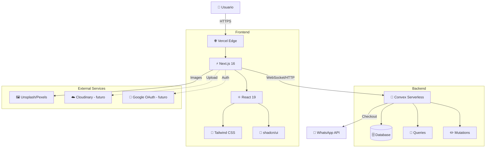
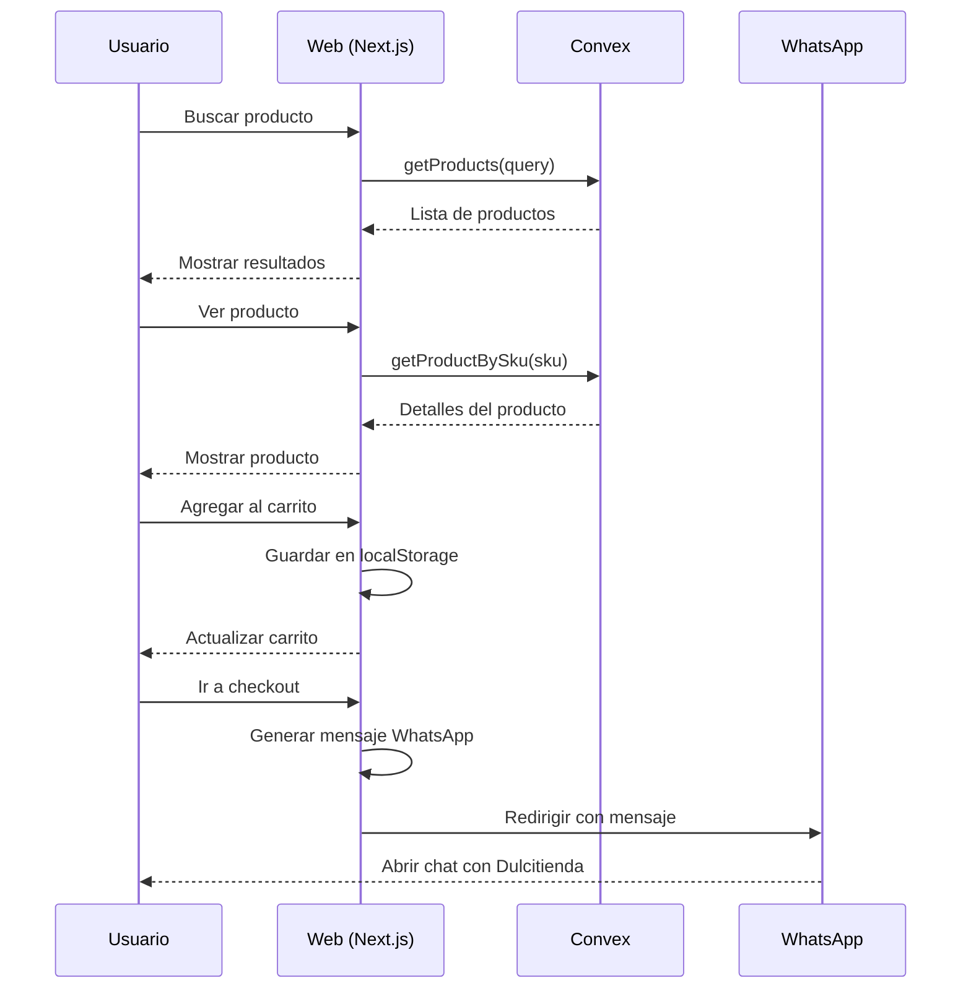
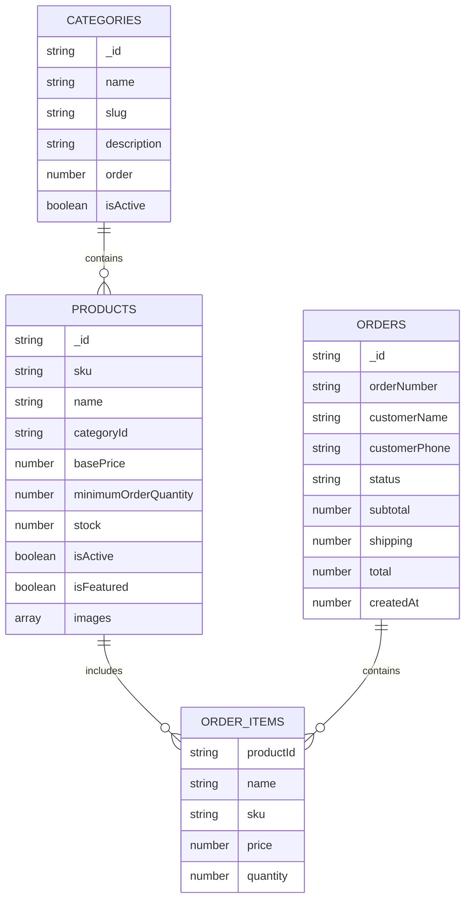
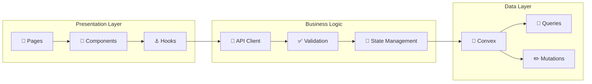
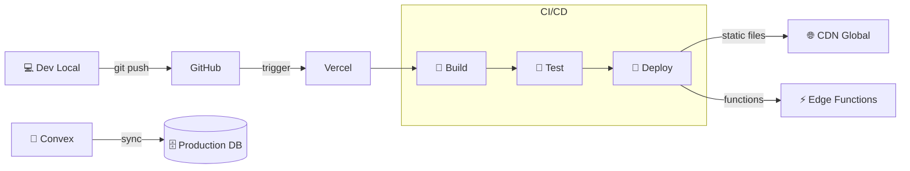
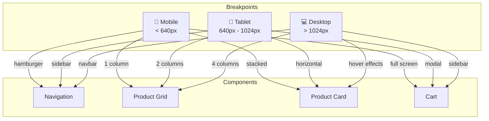
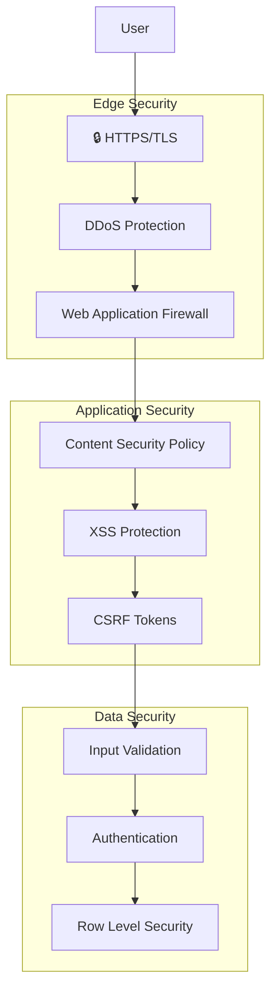
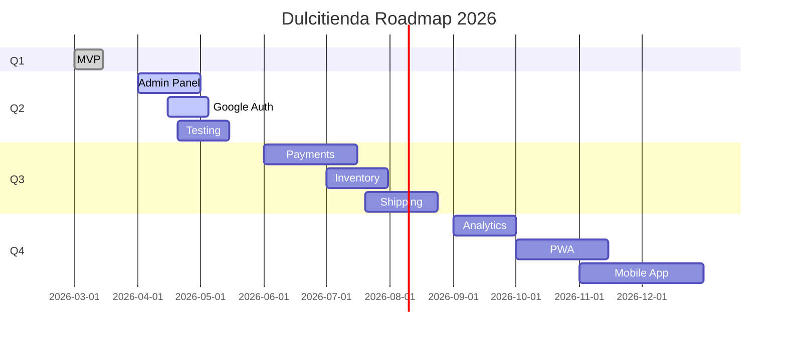
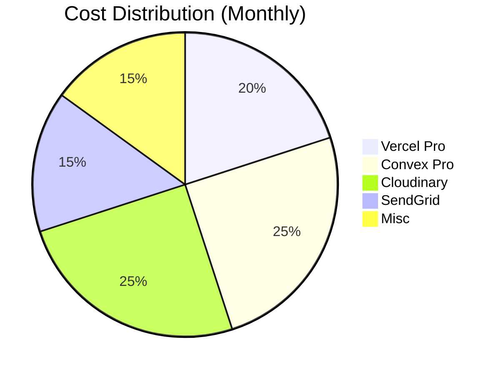
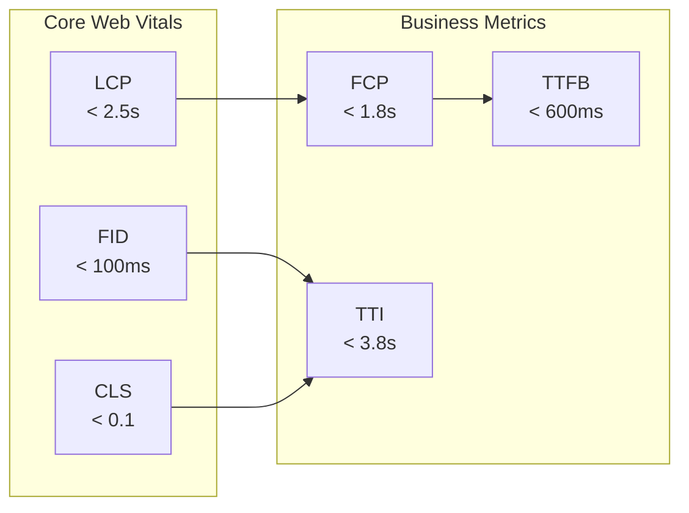

# 🏗️ Diagramas de Arquitectura

Diagramas visuales de la arquitectura de Dulcitienda.

---

## 📊 Diagrama General

---

## 🔄 Flujo de Compra

---

## 🗄️ Esquema de Base de Datos

---

## 🏛️ Arquitectura de Capas

---

## 🚀 Pipeline de Deployment

---

## 📱 Responsive Design

---

## 🔒 Security Architecture

---

## 🎯 Feature Roadmap

---

## 💰 Cost Architecture

---

## 📊 Performance Metrics

---

**Nota**: Estos diagramas se renderizan automáticamente en GitHub con Mermaid.

Para verlos renderizados, visita:
- [GitHub Mermaid Docs](https://github.blog/developer-skills/github/include-diagrams-markdown-files-mermaid/)
